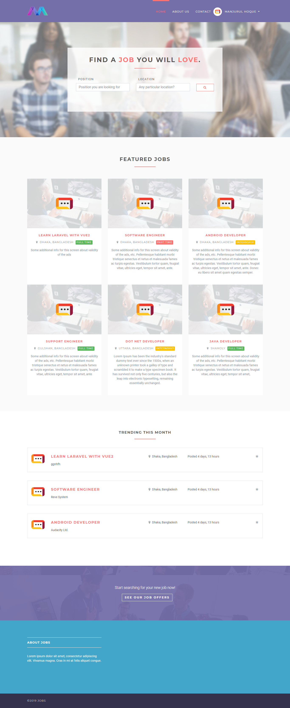
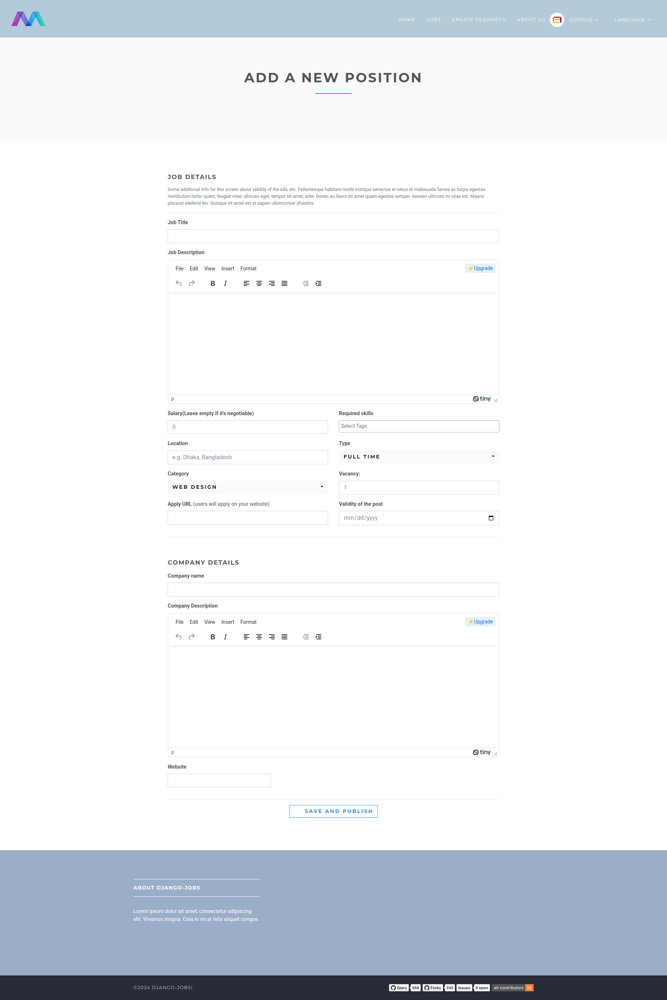
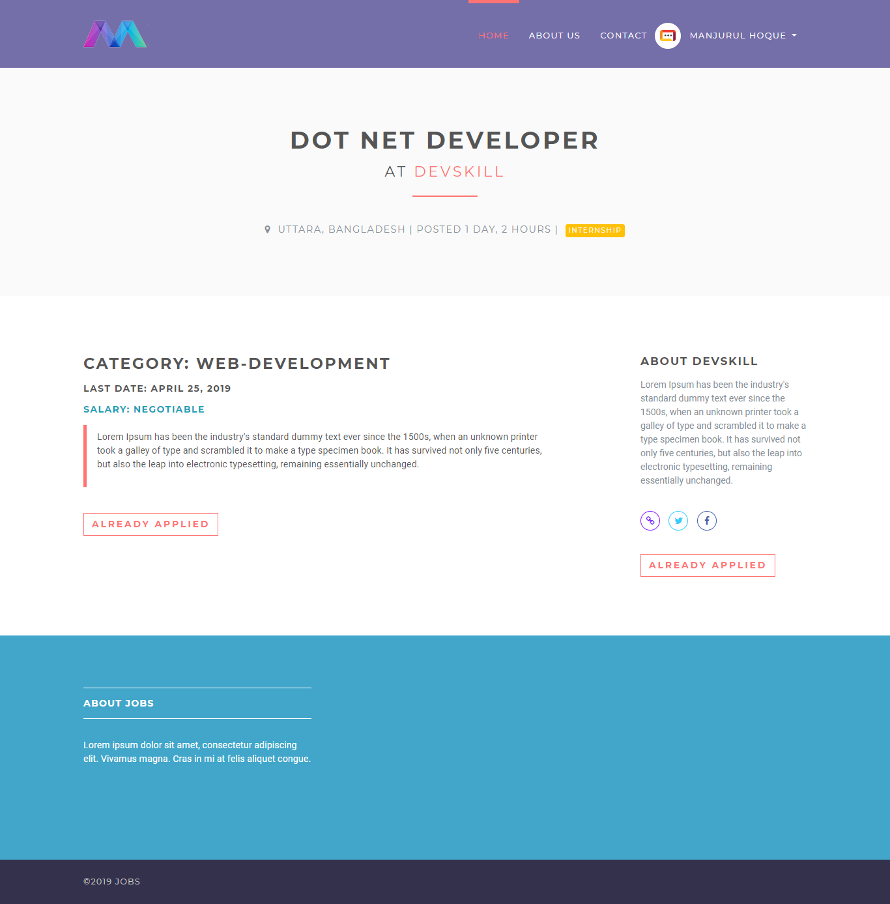

## Django Job Portal

#### An open source online job portal.

Live: [Demo](https://django-portal.herokuapp.com/) or [Second Demo](http://jobs.manjurulhoque.com/)

Used Tech Stack

1. Django
2. Sqlite

### Screenshots

## Home page

## Add new position as employer

## Job details

Show your support by 🌟 the project!!