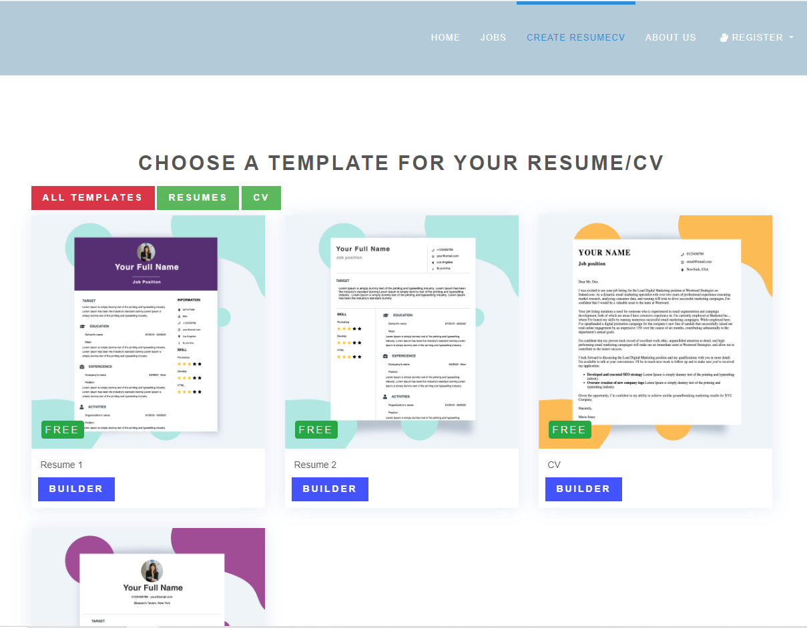
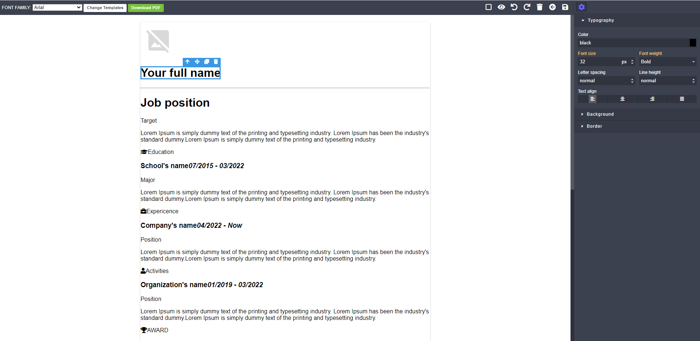

<div align="center">


# Django Job Portal

</div>

## Django Job Portal

#### An open source online job portal.

<p align="center">
    
    
    
    
</p>

Live: [Demo](http://djp.manjurulhoque.com/en/)

Used Tech Stack

1. Django
2. Sqlite

### Screenshots

## Home page


## Resume template page



## Login page


## Add new position as employer


## Job details


## Swagger API


<a name="local-venv"></a>
### Local environment

#### Install

1. Create a virtual environment

    `virtualenv venv`

    Or

    `python3.11 -m venv venv`

2. Activate it

    `source venv/bin/activate`

3. Clone the repository and install the packages in the virtual env:

    `pip install -r requirements.txt`

4. Add `.env` file.

    `cp .env.dev.sample .env`

5. Add Github client ID and client secret in the `.env` file

#### Run

1. With the venv activate it, execute:

    python manage.py collectstatic

   *Note* : Collect static is not necessary when debug is True (in dev mode)

2. Create initial database:

    `python manage.py migrate`

3. Load demo data (optional):

    `python manage.py loaddata fixtures/app_name_initial_data.json --app app.model_name`

4. Run server:

    `python manage.py runserver`

5. Default django admin credentials:

    `email: admin@admin.com`
    `password: admin`

#### Run test:
``python manage.py test``

#### To dump data:
``python manage.py dumpdata --format=json --indent 4 app_name > app_name/fixtures/app_name_initial_data.json``


Show your support by 🌟 the project!!

# Django Job Portal Testing Series

This repository contains a comprehensive testing guide for the Django Job Portal project. The series covers different aspects of testing in Django REST Framework, from basic to advanced concepts.

## Table of Contents

1. [Introduction to Testing in Django REST Framework: Part 1](#part-1-introduction-to-testing)
2. [Advanced Testing Techniques: Part 2](#part-2-advanced-testing-techniques)
3. [Coming Soon: Part 3](#part-3-coming-soon)

## Part 1: Introduction to Testing

### Why Testing Matters
- Ensuring code reliability
- Catching bugs early
- Making refactoring safer
- Documentation through tests
- Confidence in deployments

### Types of Tests
1. **Unit Tests**
   - Testing individual components
   - Example: Testing a serializer

2. **Integration Tests**
   - Testing component interactions
   - Example: Testing API endpoints

3. **End-to-End Tests**
   - Testing complete workflows
   - Example: Testing user registration flow

### Setting Up Your Testing Environment

Add this to your settings:

```python
REST_FRAMEWORK = {
    'TEST_REQUEST_DEFAULT_FORMAT': 'json'
}
```

### Example: Testing User Registration

```python
class RegistrationAPITestCase(APITestCase):
    @classmethod
    def setUpTestData(cls):
        cls.invalid_data = {
            "email": "invalid-email",
            "password": "short",  # too short
            "username": "test",
        }
        cls.valid_data = {
            "email": "test@example.com",
            "password": "testpass123",
            "password2": "testpass123",
            "gender": "male",
            "role": "employee",
        }

    def setUp(self):
        self.url = reverse("accounts.api:register")

    def test_registration_success(self):
        response = self.client.post(self.url, self.valid_data)
        self.assertEqual(response.status_code, status.HTTP_201_CREATED)
        self.assertTrue(response.data["status"])
        self.assertEqual(response.data["message"], "Successfully registered")
        self.assertTrue(User.objects.filter(email=self.valid_data["email"]).exists())

    def test_registration_invalid_data(self):
        response = self.client.post(self.url, self.invalid_data)
        self.assertEqual(response.status_code, status.HTTP_400_BAD_REQUEST)

    def test_registration_duplicate_email(self):
        User.objects.create_user(
            email=self.valid_data["email"],
            password="testpass123",
            role="employee"
        )
        response = self.client.post(self.url, self.valid_data)
        self.assertEqual(response.status_code, status.HTTP_400_BAD_REQUEST)
        self.assertEqual(response.data["errors"][0]["email"], "A user with that email already exists.")
        self.assertFalse(response.data["status"])
```

## Part 2: Advanced Testing Techniques

In Part 1, we covered the basics of testing in Django REST Framework, focusing on simple API endpoints like user registration. In Part 2, we'll explore more advanced testing techniques using our Job Portal project as an example.

### Testing Complex API Views

Let's look at how to test more complex API views that involve multiple models, authentication, and different user roles.

#### Testing Job Search Functionality

```python
class TestSearchView(TestCase):
    def setUp(self):
        self.url = reverse("jobs:search")
        super().setUp()

    def test_empty_query(self):
        jobs = Job.objects.filter(title__contains="software")
        response = self.client.get(self.url + "?position=software")
        self.assertFalse(b"We have found %a jobs" % str(jobs.count()) in response.content.lower())
```

This test demonstrates how to:
- Set up a test class for a specific view
- Use the `setUp` method to prepare test data
- Test query parameters in URLs
- Check response content for specific text

#### Testing Job Details View

```python
class TestJobDetailsView(TestCase):
    def test_details(self):
        response = self.client.get(reverse("jobs:jobs-detail", args=(1,)))
        self.assertEqual(response.status_code, 404)
```

This test shows:
- How to test views that require URL parameters
- Testing 404 responses for non-existent resources
- Using the `reverse` function with arguments

### Testing API Views with Authentication

One of the most important aspects of testing API views is handling authentication. Let's look at how to test endpoints that require different user roles.

#### Testing Common API Views

```python
class TestCommonApiViews(APITestCase):
    def setUp(self):
        # Create test data
        self.categories = CategoryFactory.create_batch(10)
        self.jobs = JobFactory.create_batch(5)
        self.user = UserFactory(role="employee")

    def test_categories_list_api_view(self):
        """Test the categories list API endpoint"""
        url = reverse("categories:categories-list")
        response = self.client.get(url)
        self.assertEqual(response.status_code, status.HTTP_200_OK)
        self.assertEqual(len(response.json()), 15)  # job factory creates 5 more categories

    def test_jobs_list_api_view(self):
        """Test the jobs list API endpoint"""
        url = reverse("jobs-api:job-list")
        response = self.client.get(url)
        self.assertEqual(response.status_code, status.HTTP_200_OK)
        self.assertEqual(len(response.json()), 5)
```

This test class demonstrates:
- Using factory classes to create test data
- Testing list endpoints
- Checking response data structure and content
- Using docstrings to document test purposes

#### Testing Authentication-Required Endpoints

```python
def test_apply_job_api_view(self):
    """Test the apply job API endpoint"""
    # apply job without authentication
    url = reverse("jobs-api:apply-job", kwargs={"job_id": self.jobs[0].id})
    response = self.client.post(url)
    self.assertEqual(response.status_code, status.HTTP_401_UNAUTHORIZED)

    # apply job with authentication
    self.client.force_authenticate(user=self.user)
    response = self.client.post(url, {"job": self.jobs[0].id})
    self.assertEqual(response.status_code, status.HTTP_201_CREATED)
    self.assertEqual(response.json()["job"], self.jobs[0].id)

    # test already apply to same job
    url = reverse("jobs-api:apply-job", kwargs={"job_id": self.jobs[0].id})
    response = self.client.post(url, {"job": self.jobs[0].id})
    self.assertEqual(response.status_code, status.HTTP_400_BAD_REQUEST)
```

This test shows:
- Testing endpoints with and without authentication
- Using `force_authenticate` to simulate logged-in users
- Testing business logic (preventing duplicate applications)
- Testing different HTTP status codes

### Testing Role-Based Access Control

In a job portal, different user roles (employer, employee) have different permissions. Let's see how to test this:

```python
class TestEmployerApiViews(APITestCase):
    @classmethod
    def setUpTestData(cls):
        """Set up test data for all test methods"""
        cls.employer = UserFactory(role="employer")
        cls.employee = UserFactory(role="employee")
        cls.tag = TagFactory()
        cls.job_data = {
            "title": "Test Job",
            "description": "Test Description",
            "location": "Test Location",
            "salary": 10000,
            "type": "1",  # Full time
            "category": "web-development",
            "last_date": "2024-12-31",
            "company_name": "Test Company",
            "company_description": "A great company to work for",
            "website": "www.testcompany.com",
            "tags": [cls.tag.pk],
        }

    def setUp(self):
        """Set up test client for each test method"""
        self.job = JobFactory(user=self.employer)
        self.client = self.client_class()

    def test_dashboard_api_view(self):
        """Test the dashboard API endpoint"""
        # check without authentication
        url = reverse("jobs-api:employer-dashboard")
        response = self.client.get(url)
        self.assertEqual(response.status_code, status.HTTP_401_UNAUTHORIZED)

        # check with authentication
        self.client.force_authenticate(user=self.employer)
        response = self.client.get(url)
        self.assertEqual(response.status_code, status.HTTP_200_OK)
        self.assertEqual(len(response.json()), 1)
        self.assertEqual(response.json()[0]["id"], self.job.id)
```

This test class demonstrates:
- Using `setUpTestData` for data shared across all tests
- Testing role-based access control
- Testing dashboard views
- Verifying response data matches expected results

### Testing Complex Workflows

Let's look at testing a complete workflow, like applying for a job and checking application status:

```python
def test_applied_jobs_api_view(self):
    """Test the applied jobs API endpoint"""
    # get applied jobs without authentication
    applied_jobs_url = reverse("jobs-api:applied-jobs")
    response = self.client.get(applied_jobs_url)
    self.assertEqual(response.status_code, status.HTTP_401_UNAUTHORIZED)

    # get applied jobs with authentication
    self.client.force_authenticate(user=self.user)
    response = self.client.get(applied_jobs_url)
    self.assertEqual(response.status_code, status.HTTP_200_OK)
    self.assertEqual(len(response.json()), 0)

    # apply job
    url = reverse("jobs-api:apply-job", kwargs={"job_id": self.jobs[0].id})
    response = self.client.post(url, {"job": self.jobs[0].id})
    self.assertEqual(response.status_code, status.HTTP_201_CREATED)

    # get applied jobs again
    response = self.client.get(applied_jobs_url)
    self.assertEqual(response.status_code, status.HTTP_200_OK)
    self.assertEqual(len(response.json()), 1)
    self.assertEqual(response.json()[0]["applicant"]["job"]["id"], self.jobs[0].id)
```

This test demonstrates:
- Testing a multi-step workflow
- Verifying state changes after actions
- Testing related endpoints that depend on each other
- Checking response data structure in detail

### Testing Edge Cases and Error Handling

Good tests should also cover edge cases and error handling:

```python
def test_update_applicant_status_api_view(self):
    """Test the update applicant status API endpoint"""
    # apply for the job
    self.client.force_authenticate(user=self.employee)
    apply_url = reverse("jobs-api:apply-job", kwargs={"job_id": self.job.id})
    self.client.post(apply_url, {"job": self.job.id})

    # update applicant status without authentication
    self.client.logout()
    url = reverse(
        "jobs-api:employer-update-applicant-status",
        kwargs={"applicant_id": self.employee.id, "status_code": 1},
    )
    response = self.client.post(url)
    self.assertEqual(response.status_code, status.HTTP_401_UNAUTHORIZED)

    # check with authentication
    self.client.force_authenticate(user=self.employer)
    response = self.client.post(url)
    self.assertEqual(response.status_code, status.HTTP_404_NOT_FOUND)

    url = reverse(
        "jobs-api:employer-update-applicant-status",
        kwargs={"applicant_id": self.job.id, "status_code": 10},
    )
    response = self.client.post(url)
    self.assertEqual(response.status_code, status.HTTP_200_OK)
```

This test shows:
- Testing authentication changes during a test
- Testing error responses (404 Not Found)
- Testing different status codes
- Testing complex URL patterns with multiple parameters

## Best Practices for Advanced Testing

1. **Use Factory Classes**
   - Create reusable test data with factory classes
   - Use `setUpTestData` for data shared across all tests
   - Use `setUp` for test-specific setup

2. **Test Authentication and Authorization**
   - Test endpoints with and without authentication
   - Test different user roles
   - Test permission boundaries

3. **Test Complete Workflows**
   - Test multi-step processes
   - Verify state changes after actions
   - Test related endpoints that depend on each other

4. **Test Edge Cases and Error Handling**
   - Test invalid inputs
   - Test error responses
   - Test business logic constraints

5. **Write Clear Test Names and Docstrings**
   - Use descriptive test method names
   - Add docstrings to explain test purposes
   - Group related tests in test classes

## Running Tests

Run all tests:
```bash
python manage.py test
```

Run specific test case:
```bash
python manage.py test jobsapp.tests.test_job_api.JobCreationAPITestCase
```

Run tests with coverage:
```bash
coverage run --source='.' manage.py test
coverage report
```

## Part 3: Coming Soon

In the next part, we'll cover:
- Testing file uploads for resumes
- Testing search functionality with complex queries
- Testing pagination and filtering
- Testing permissions and authorization in detail
- Writing test fixtures for complex data setup
- Mocking external services in tests

## Contributing

Feel free to contribute to this testing guide by submitting pull requests or creating issues.

## License

This project is licensed under the MIT License - see the LICENSE file for details.
